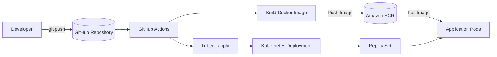
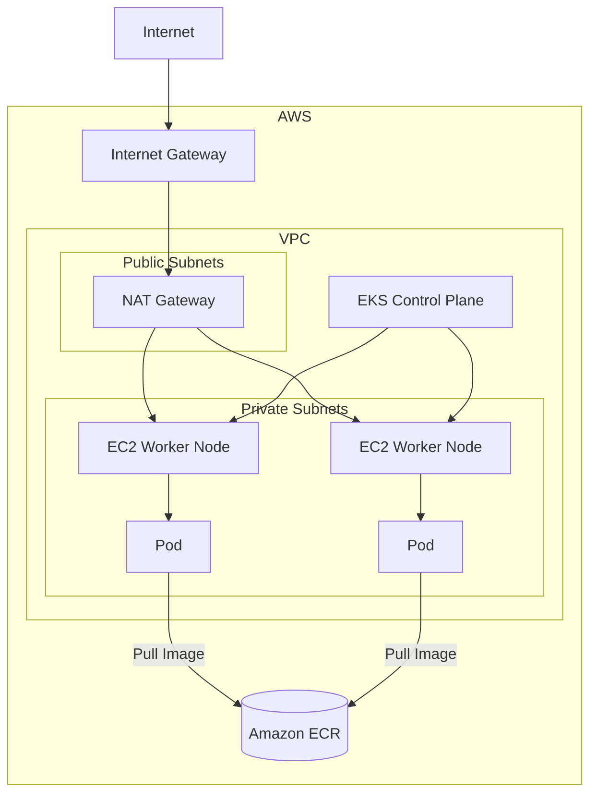
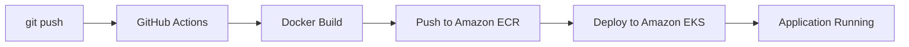
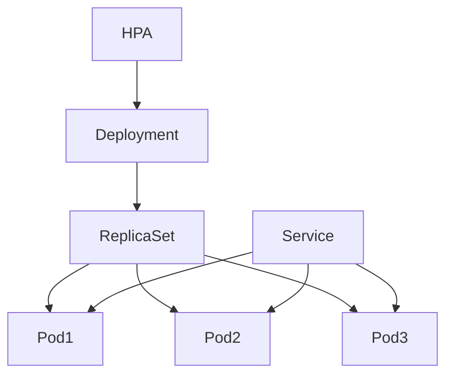

# AWS EKS DevOps Platform


Production-style DevOps platform built on AWS using Terraform, Amazon EKS, Docker, and GitHub Actions.

This project provisions AWS infrastructure as code and automates container deployments to Kubernetes through a secure CI/CD pipeline using GitHub Actions and Amazon ECR.


## Table of Contents

- [Project Goals](#project-goals)
- [Architecture](#architecture)
- [Tech Stack](#tech-stack)
- [Design Decisions](#design-decisions)
- [Infrastructure](#infrastructure)
- [Repository Structure](#repository-structure)
- [CI/CD Pipeline](#cicd-pipeline)
- [Kubernetes Deployment](#kubernetes-deployment)
- [Screenshots](#screenshots)
- [Getting Started](#getting-started)
- [Security](#security)
- [Future Improvements](#future-improvements)
- [What I Learned](#what-i-learned)


## Project Goals

This project was built to demonstrate:

- Infrastructure as Code with Terraform
- Kubernetes deployment on Amazon EKS
- Automated CI/CD with GitHub Actions
- Secure AWS authentication using GitHub OIDC
- Container image management with Amazon ECR


## Architecture




## Tech Stack

| Category   | Technology     |
| ---------- | -------------- |
| Cloud      | AWS            |
| Compute    | Amazon EKS     |
| Registry   | Amazon ECR     |
| Networking | Amazon VPC     |
| IaC        | Terraform      |
| Container  | Docker         |
| CI/CD      | GitHub Actions |
| Monitoring | CloudWatch     |
| Language   | Node.js        |


## Design Decisions

### Why Terraform?

Terraform was chosen to provision AWS resources consistently using reusable modules and remote state management.

### Why Amazon EKS?

Amazon EKS was selected to gain hands-on experience with a managed Kubernetes service while focusing on application deployment rather than cluster management.

### Why GitHub Actions?

GitHub Actions automates Docker image builds and Kubernetes deployments whenever changes are pushed to the `main` branch.

### Why OIDC?

GitHub Actions authenticates to AWS using OpenID Connect (OIDC), eliminating the need for long-lived IAM access keys.

### Why Amazon ECR?

Amazon ECR provides seamless integration with Amazon EKS and simplifies container image management.


## Infrastructure




## Repository Structure

```text
.
├── app/
├── docs/
├── k8s/
├── terraform/
│   ├── bootstrap/
│   ├── envs/
│   │   └── dev/
│   └── modules/
│       ├── ecr/
│       ├── eks/
│       ├── github-actions/
│       └── vpc/
└── .github/
    └── workflows/
```

## CI/CD Pipeline



## Kubernetes Deployment



## Screenshots

> 🚧 This section is under development.

Planned screenshots:

- [ ] Terraform Apply
- [ ] AWS Console (EKS)
- [ ] GitHub Actions Workflow
- [ ] Kubernetes Resources
- [ ] Application Response


## Getting Started

### Prerequisites

Before you begin, ensure you have the following tools installed:

- AWS CLI
- Terraform
- Docker
- kubectl
- Git
- An AWS account with appropriate permissions

Verify the installation:

```bash
aws --version
terraform --version
docker --version
kubectl version --client
git --version
```

---

### Step 1. Create the Terraform Backend

Initialize and provision the remote backend for Terraform state management.

```bash
cd terraform/bootstrap

terraform init
terraform apply
```

**Expected Result**

- S3 bucket created for Terraform state
- DynamoDB table created for state locking

---

### Step 2. Deploy AWS Infrastructure

Provision the AWS infrastructure using Terraform.

```bash
cd ../envs/dev

terraform init
terraform apply
```

**Resources Created**

- Amazon VPC
- Public and Private Subnets
- NAT Gateway
- Amazon EKS Cluster
- Managed Node Group
- Amazon ECR Repository
- IAM Roles
- CloudWatch Logs

---

### Step 3. Configure kubectl

Configure your local Kubernetes client to connect to the EKS cluster.

```bash
aws eks update-kubeconfig \
  --region ap-northeast-1 \
  --name portfolio-eks
```

Verify the connection:

```bash
kubectl get nodes
```

**Expected Result**

```
NAME                                           STATUS   ROLES    AGE   VERSION
ip-10-0-x-xx.ap-northeast-1.compute.internal   Ready    <none>   ...
```

---

### Step 4. Deploy the Application

Deploy the Kubernetes manifests.

```bash
kubectl apply -f k8s/
```

This creates:

- Namespace
- Deployment
- Service
- Horizontal Pod Autoscaler (HPA)

---

### Step 5. Verify the Deployment

Check that the resources are running correctly.

List Pods:

```bash
kubectl get pods -n portfolio
```

List Services:

```bash
kubectl get svc -n portfolio
```

List HPA:

```bash
kubectl get hpa -n portfolio
```

Expected output:

```
NAME          READY   STATUS    RESTARTS   AGE
portfolio-1   1/1     Running   0          1m
```

---

### Access the Application

Retrieve the external LoadBalancer endpoint.

```bash
kubectl get svc -n portfolio
```

Example:

```
NAME             TYPE           EXTERNAL-IP
portfolio-app    LoadBalancer   xxxxxxxxx.elb.amazonaws.com
```

Open the endpoint in your browser or use curl:

```bash
curl http://<LOAD_BALANCER_ENDPOINT>
```

Example response:

```json
{
  "message": "Hello from EKS!",
  "hostname": "portfolio-7d8f9f5d7c-abcde"
}
```

---


### CI/CD Deployment

Once the infrastructure is provisioned, every push to the `main` branch automatically triggers the deployment pipeline.

The pipeline performs the following actions:

1. Build the Docker image
2. Push the image to Amazon ECR
3. Update the Kubernetes Deployment on Amazon EKS

No manual deployment is required after the CI/CD pipeline is configured.


## Security

- GitHub Actions authenticates to AWS using OpenID Connect (OIDC)
- No long-lived AWS IAM access keys are stored in GitHub Secrets
- IAM policies follow the principle of least privilege
- Terraform remote state is protected with S3 versioning and DynamoDB state locking
- Amazon EKS API server logging is enabled with CloudWatch Logs


## Future Improvements

Planned enhancements:

### Infrastructure

- AWS Load Balancer Controller
- ExternalDNS
- HTTPS (ACM)

### Observability

- Prometheus
- Grafana
- Fluent Bit

### Platform

- ArgoCD
- Multi-environment deployment
- Karpenter


## What I Learned

Through this project I learned how to:

- Design AWS networking for Kubernetes
- Build reusable Terraform modules
- Configure GitHub OIDC authentication
- Deploy containerized applications to Amazon EKS
- Implement CI/CD pipelines with GitHub Actions
